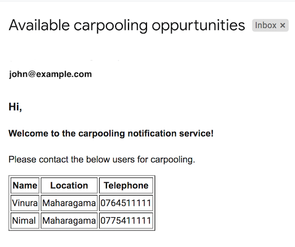

# Carpooling Notification System

Carpooling Notification System provides a Ballerina API  to send a notification about nearest available carpooling options using a users' location.

Following are the steps that is used to implement the logic. 

- Gather location details about the users who are interested in sharing their vehicles using a google spreadsheet. 
- Get the location of the user who is searching for a carpooling service.
- Identify the most suitable carpooling candidates. 
- Notify the user about carpooling details via email.


## APIs

Following are the three different APIs that are integrated in this system. 

- Google spread sheet API 
- Google maps distance matrix API 
- Gmail API 

## Ballerina Connectors

Following are the two different Ballerina connectors used in this system.

- Spreadsheet Connector
- Gmail Connector

## Getting Started

- Clone the repository.
- Go to the folder CarpoolingNotificationCenter and initialize the Ballerina project.
    ```
    ballerina init
    ```
- Create a ballerina.conf file under the root repository(CarpoolingNotificationCenter).
- Add following configurations in to ballerina.conf file.

    ```
    ACCESS_TOKEN="access token"
    CLIENT_ID="client id"
    CLIENT_SECRET="client secret"
    REFRESH_TOKEN="refresh token"
    SPREADSHEET_ID="spreadsheet id you have extracted from the sheet url"
    SHEET_NAME="sheet name of your Goolgle Sheet. For example in above example, SHEET_NAME="Candidate"
    SENDER="email address of the sender"
    USER_ID="mail address of the authorized user. You can give this value as, me"
    SUBJECT="subject of the email"
    API_KEY="api key for the distance matrix API(Google Maps API)"
    ```

- Go through the following steps to obtain credentials and tokens for both Google Sheets and GMail APIs.
    1. Visit [Google API Console](https://console.developers.google.com), click **Create Project**, and follow the wizard 
    to create a new project.
    2. Enable both GMail and Google Sheets APIs for the project.
    3. Go to **Credentials -> OAuth consent screen**, enter a product name to be shown to users, and click **Save**.
    4. On the **Credentials** tab, click **Create credentials** and select **OAuth client ID**. 
    5. Select an application type, enter a name for the application, and specify a redirect URI 
    (enter https://developers.google.com/oauthplayground if you want to use 
    [OAuth 2.0 playground](https://developers.google.com/oauthplayground) to receive the authorization code and obtain the 
    access token and refresh token). 
    6. Click **Create**. Your client ID and client secret appear. 
    7. In a separate browser window or tab, visit [OAuth 2.0 playground](https://developers.google.com/oauthplayground), 
    select the required GMail and Google Sheets API scopes, and then click **Authorize APIs**.
    8. When you receive your authorization code, click **Exchange authorization code for tokens** to obtain the refresh 
    token and access token.         

- Create a Google Sheet as follows from the same Google account you have obtained the client credentials and tokens 
to access both APIs.


- Obtain the spreadsheet id by extracting the value between the "/d/" and the "/edit" in the URL of your spreadsheet.

### Running an example
- Go to the CarpoolingNotificationCenter folder and run the following command.

    ```
    ballerina run Notification/
    ```
- Use the below curl command to send the request.

    ```
    curl -X POST \
        http://localhost:9090/carpooling/notify \
        -H 'cache-control: no-cache' \
        -H 'content-type: application/json' \
        -H 'postman-token: 1aca9f7c-9862-096a-cde6-b301dced1030' \
        -d '{
	        "Email":"john@example.com",
	        "Location": "nugegoda"
    }'
    ```

- Then a notification will be sent to john@example.com



